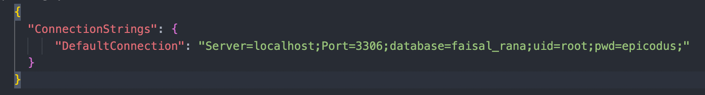
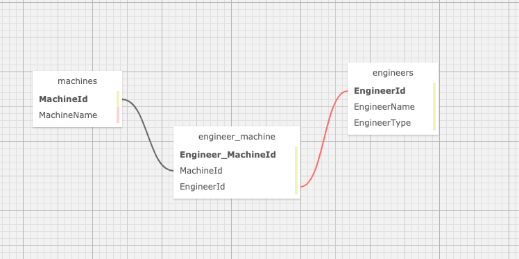

# Dr. Sillystringz's Factory

### Epicodus Independent Code Review - Many-To-Many Relationships

### By Faisal Rana

## Technologies Used

* Git
* C#
* .NET 5.0
* ASP.NET Core
* Entity Framework Core
* Razor View Engine
* MVC
* RESTful Routing, CRUD & HTTP
* REPL
* MySQL & MySQL Workbench
* Bootstrap
* CSS
* Many-to-Many Relationships

## Description

This is a C# MVC web application that is built to manage Engineers and Machines in a factory.  The engineers and machines have a 'many-to-many' relationship because each engineer can be assigned to work on multiple machines, whilst each machine can be repaired by multiple engineers. 

This webpage must have the following additional functionality:
1. Splash page where all engineers and machines are displayed
2. Machine detail view must show associated engineers, while Engineer detail page must show associated machines. 
3. Add/Remove/Edit functionality will be needed so the manager can input/remote/edit data.

## Setup/Installation Requirements

* _Download Visual Studio Code Installation_
* _Open the terminal on your local machine_
* _Navigate to the project root directory_
* _Clone this project with the following command  `$ git clone <https://github.com/FaisalRana/SillyStringz.Solution.git>`_
* _Download and install .NET Core through this link if you don't already have it: https://dotnet.microsoft.com/download_
* _Open this project in Visual Studio Code with the command `$ code .`_
* _Navigate to the `Factory` directory and create an **appsettings.json** file and input the following script. 

* _Retrieve and install packages listed in the .csproj files with the command `$ dotnet restore`_
* _Follow instructions **below** to install mySQL abd mySQL workbench **below**_
* _Create internal content for build with the command `$ dotnet build`_
* _Follow instructions for migrating database **below**_
* _Use command `$ dotnet run`_ to launch web application.

**MySQL and MySQL Workbench Setup Instructions**

* Download MySQL Workbench here: https://dev.mysql.com/downloads/file/?id=484391
* For Mac Users please [Click Here](https://dev.mysql.com/downloads/file/?id=484914) to download MySQL Installer
* For Windows Users please [Click Here](https://dev.mysql.com/downloads/file/?id=484919)
* Verify MySQL installation by opening the terminal and entering the command `mysql -uroot -p[THEPASSWORDYOUSELECTED]`

**Database Migration Instructions**
1. Navigate to Factory directory in terminal
2. Use the command `dotnet ef migrations iniital` and  `dotnet ef database update` to create database migration. 

## Diagram of the Many-To-Many relationship used in this project

## User Stories 
 
- As the factory manager, Dr. SS needs to be able to see a list of all engineers, and they need to be able to see a list of all machines | 
- As the factory manager, Dr. SS needs to be able to select an engineer, see their details, and see a list of all machines that engineer is licensed to repair. They also need to be able to select a machine, see its details, and see a list of all engineers licensed to repair it | 
- As the factory manager, Dr. SS needs to add new engineers to our system when they are hired. They also need to add new machines to our system when they are installed | 
- As the factory manager, Dr. SS should be able to add new machines even if no engineers are employed. They should also be able to add new engineers even if no machines are installed | 
-  As the factory manager, Dr. SS needs to be able to add or remove machines that a specific engineer is licensed to repair. They also need to be able to modify this relationship from the other side, and add or remove engineers from a specific machine |
- Dr.SillyStringz should be able to navigate to a splash page that lists all engineers and machines. Users should be able to click on an individual engineer or machine to see all the engineers/machines that belong to it |

## Known Bugs

Currently there is no use for the index pages for machines and engineers.  The delete page could be simplified as well. I dont think a confirmation page is neccesary. 

## Link

Currently, this project is not hosted online. 

## License

Copyright (c) 2021 Faisal Rana

This software is licensed under the MIT license

